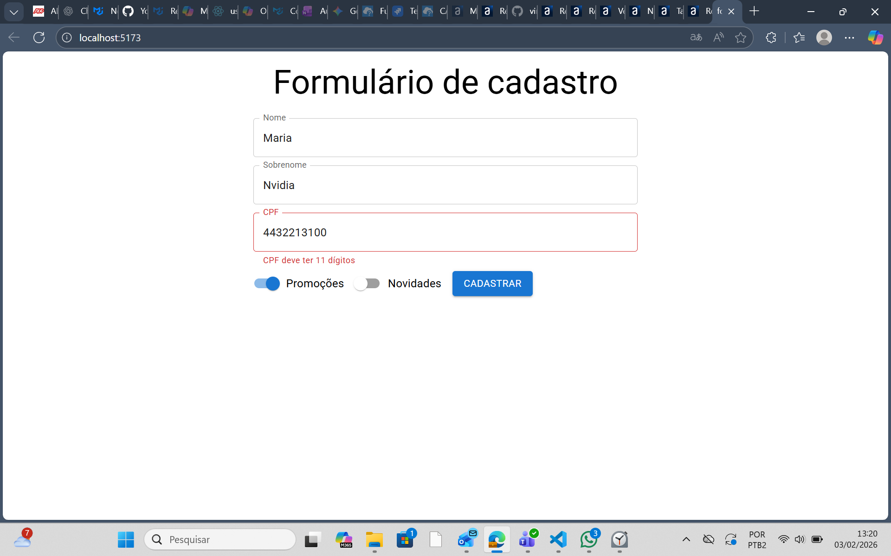

# FormularioReact — Aplicação React + TypeScript (Vite)

Aplicação simples em React + TypeScript gerada com Vite que demonstra um formulário de cadastro com componentes do Material UI e validação de CPF.

## Captura de tela

Abaixo há uma captura de tela da aplicação em execução. Para que a imagem apareça no GitHub, o arquivo precisa estar presente no branch e commitado em `public/formulario_screenshot.png`.



## Visão Geral

- **Descrição**: Projeto de exemplo que contém um componente de formulário (`FormularioCadastro`) com campos controlados e validação local de CPF.
- **UI**: Utiliza `@mui/material` e `@emotion` para estilos.

## Como Rodar

- Instalar dependências:

```bash
npm install
```

- Desenvolvimento (HMR):

```bash
npm run dev
```

- Build para produção:

```bash
npm run build
```

- Preview do build:

```bash
npm run preview
```

- Lint:

```bash
npm run lint
```

## Estrutura Principal

- Código-fonte: [src](src)
- Componente de formulário: [src/assets/components/FomularioCadastro/formularioCadastro.tsx](src/assets/components/FomularioCadastro/formularioCadastro.tsx)
- Validação de CPF: [src/assets/components/validators/ValidaCpf.tsx](src/assets/components/validators/ValidaCpf.tsx)
- Entrada da app: [src/main.tsx](src/main.tsx) e [src/App.tsx](src/App.tsx)

## Sobre o componente `FormularioCadastro`

- **Contrato (`onSubmit`)**: O componente expõe uma prop opcional `onSubmit` que recebe um objeto com os campos:

  - `nome`
  - `sobrenome`
  - `cpf`
  - `promocoes` (boolean)
  - `novidades` (boolean)

- **Comportamento de validação**: O campo `CPF` é normalizado para conter apenas dígitos e é truncado para 11 caracteres antes de atualizar o estado.
- **Campos controlados**: Todos os campos do formulário são controlados via `useState` e atualizados por `onChange`.

- Não alterar o contrato do `onSubmit` sem atualizar todos os pontos do código que o consomem.
- Preferir componentes MUI para manter consistência de UI/accessibilidade.

## Contribuindo / Extensões

- Para adicionar chamadas a APIs, crie `src/services` e centralize os clientes/interceptadores.
- Antes de abrir PR, rode `npm run lint` e verifique o comportamento com `npm run dev`.

## Referências rápidas

- Formulário principal: [src/assets/components/FomularioCadastro/formularioCadastro.tsx](src/assets/components/FomularioCadastro/formularioCadastro.tsx)
- Validador CPF: [src/assets/components/validators/ValidaCpf.tsx](src/assets/components/validators/ValidaCpf.tsx)
